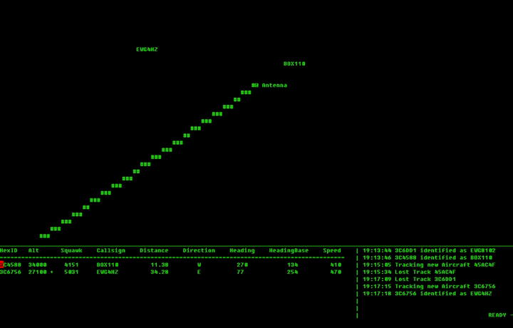

# cliradar

Plot ADS-B Data from dump1090 on the Linux Console.

## Requirements

 - Python 2.7
 - Python Modules: geopy, sqlite3
 - A RTL-SDR Receiver
 - A Running Dump1090 Instance
 - Linux (not tested on Windows/Mac)

## Usage

 1. clone this repo
 2. before starting make sure, that dump1090 is listening on 127.0.0.1:30003
 3. Adjust Line 15/16 to match your Longitude/Latitude
 4. make sure you have a wide terminal
 5. start cliradar.py

## Known Issues

 - Radar Beam Rotation looks clunky
 - Better Terminal Resize (actually it needs a wide Terminal)
 - rarely READY and Spinner Text moves to top
 - rarely Planes move into wrong direction

